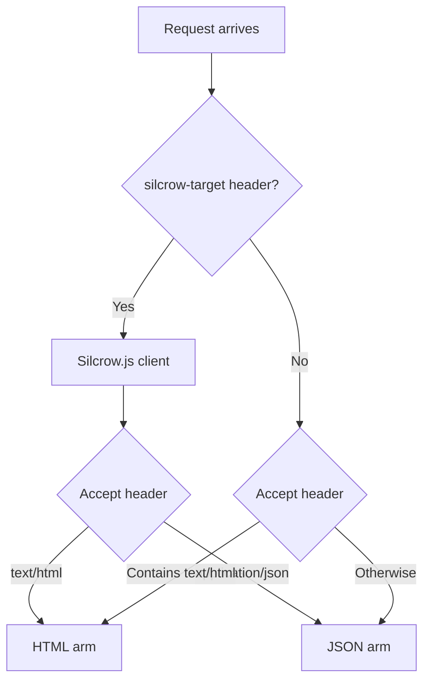

# Getting Started

This guide walks you through creating your first Pilcrow application — a dual-mode handler that serves HTML to browsers and JSON to API clients.

## Project Setup

```toml
# Cargo.toml
[dependencies]
pilcrow = "0.1"
axum = "0.7"
tokio = { version = "1", features = ["macros", "rt-multi-thread"] }
serde = { version = "1", features = ["derive"] }
serde_json = "1"
```

## Your First Handler

A Pilcrow handler takes a `SilcrowRequest` and uses the `respond!` macro to declare what to return for each content type:

```rust
use axum::{response::Response, routing::get, Router};
use pilcrow::*;
use serde::Serialize;

#[derive(Serialize)]
struct Greeting {
    message: String,
}

async fn home(req: SilcrowRequest) -> Result<Response, Response> {
    let greeting = Greeting {
        message: "Hello from Pilcrow!".into(),
    };

    respond!(req, {
        html => html(format!(
            "<html><head>{}</head><body><h1>{}</h1></body></html>",
            assets::script_tag(),
            greeting.message
        )),
        json => json(&greeting),
    })
}

#[tokio::main]
async fn main() {
    let app = Router::new()
        .route(&assets::silcrow_js_path(), get(assets::serve_silcrow_js))
        .route("/", get(home));

    let listener = tokio::net::TcpListener::bind("127.0.0.1:3000")
        .await
        .unwrap();
    axum::serve(listener, app).await.unwrap();
}
```

## Testing It

```bash
# Browser request → HTML
curl http://127.0.0.1:3000

# API request → JSON
curl -H "Accept: application/json" http://127.0.0.1:3000
```

## How Content Negotiation Works

When a request arrives, `SilcrowRequest` inspects the `Accept` header and the `silcrow-target` header to decide which arm to execute:



- **Browser** (normal navigation): sends `Accept: text/html` → **HTML arm** runs
- **Silcrow.js** (client-side navigation): sends `silcrow-target: true` + `Accept` based on `s-html` attribute → **HTML or JSON arm**
- **API client** (`curl -H "Accept: application/json"`): → **JSON arm** runs
- **Default**: if nothing matches, falls back to **JSON arm**

## The `respond!` Macro

The macro has five patterns. Here they all are:

```rust
// 1. Both arms — HTML + pre-wrapped JSON
respond!(req, { html => html(markup), json => json(data) })

// 2. Both arms — HTML + raw JSON (auto-wrapped)
respond!(req, { html => html(markup), json => raw data })

// 3. HTML-only (JSON requests → 406 Not Acceptable)
respond!(req, { html => html(markup) })

// 4. JSON-only (HTML requests → 406 Not Acceptable)
respond!(req, { json => json(data) })

// 5. Any pattern + shared toast
respond!(req, { html => html(markup), json => json(data), toast => ("Saved!", "success") })
```

**`json()` vs `raw`**: Use `json(data)` when you want to chain modifiers (`.with_toast()`, `.no_cache()`). Use `raw data` when you just want to return a serializable value with no modifiers.

## Serving Silcrow.js

Pilcrow embeds `silcrow.js` at compile time with a content-hashed filename for immutable caching:

```rust
use pilcrow::assets::{serve_silcrow_js, silcrow_js_path, script_tag};

// Register the route
Router::new()
    .route(&silcrow_js_path(), get(serve_silcrow_js))

// In your HTML layout — returns <script src="/_silcrow/silcrow.{hash}.js" defer></script>
fn layout(content: &str) -> String {
    format!("<html><head>{}</head><body>{content}</body></html>", script_tag())
}
```

The script is served with `Cache-Control: public, max-age=31536000, immutable` — browsers cache it forever and the hash changes on rebuild.

## Next Steps

- [Template Engines](templates.md) — integrate Maud or Askama for proper templating
- [Forms & Mutations](forms-and-mutations.md) — handle POST requests
