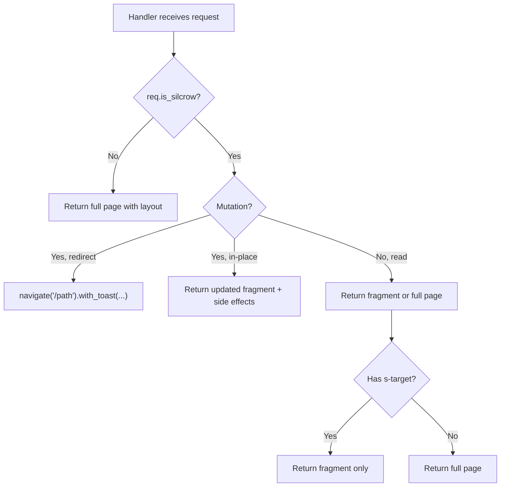

# Partials & Targets

This guide explains how Silcrow.js handles partial HTML updates, how `s-target` works, and how to update multiple parts of the page from a single response.

## Full Page vs Partial

| Scenario | Client sends | Server returns |
| --- | --- | --- |
| First page load (browser) | Normal GET | Full `<html>` page |
| Silcrow.js click (no `s-target`) | GET with `silcrow-target` | Full `<html>` page (body replaced) |
| Silcrow.js click with `s-target` | GET with `silcrow-target` | HTML fragment (swapped into target) |

## Using `s-target`

Add `s-target` to any element with `s-action` to swap content into a specific DOM element:

```html
<nav>
  <!-- No s-target → swaps entire <body> -->
  <a s-action="/dashboard">Dashboard</a>

  <!-- s-target="#content" → swaps only into #content -->
  <a s-action="/items" s-target="#content">Items</a>
</nav>

<main id="content">
  <!-- This gets replaced when clicking "Items" -->
</main>
```

## Server-Side: Detecting Partial Requests

The server doesn't need to know about `s-target` in most cases — Silcrow.js handles the extraction client-side. But you can check `req.is_silcrow` to skip the layout:

```rust
async fn items(req: SilcrowRequest) -> Result<Response, Response> {
    let items = db.list_items().await?;
    let fragment = render_items_table(&items);

    let markup = if req.is_silcrow {
        fragment // Silcrow.js client — just the fragment
    } else {
        layout("Items", &fragment) // Browser — full page
    };

    respond!(req, {
        html => html(markup),
        json => raw items,
    })
}
```

> **Tip:** With Askama, use `` for full pages. For fragments, skip the `` and render just the block content.

## Server-Side Retarget

Override the client's target from the server with `.retarget()`:

```rust
respond!(req, {
    html => html("<p>This goes into #sidebar</p>")
        .retarget("#sidebar"),
    json => json(&data),
})
```

Silcrow.js reads the `silcrow-retarget` header and swaps the content into the new target instead of the original one.

## Multi-Target Updates

A single response can update multiple parts of the page:

```rust
async fn save_item(req: SilcrowRequest) -> Result<Response, Response> {
    let item = db.save_item(&payload).await?;
    let count = db.item_count().await?;

    respond!(req, {
        html => html(render_item(&item))
            // Primary: replace the main content
            // Secondary: patch the counter with JSON data
            .patch_target("#item-count", &serde_json::json!({"count": count}))
            // Tertiary: rebuild bindings on sidebar
            .invalidate_target("#sidebar"),
        json => json(&item),
    })
}
```

Execution order: main swap → `patch_target` → `invalidate_target` → any other side effects.

### `.patch_target(selector, &data)`

Patches JSON data into a secondary element. The target element must have `s-bind` attributes:

```html
<span id="item-count" s-bind="count">0</span>
```

The server sends `{"count": 42}`, and Silcrow.js patches it into the element.

### `.invalidate_target(selector)`

Rebuilds the binding map for a subtree. Use when HTML structure has changed and bindings need to be re-scanned.

## When to Send What



**Rules of thumb:**

1. **First load** → full page with layout and `script_tag()`
2. **Silcrow.js navigations** → full page (Silcrow.js extracts `<body>` or `s-target`)
3. **Mutations** → redirect + toast, or return updated fragment
4. **Targeted updates** → just the fragment, no layout wrapper

## Next Steps

- [Server-Sent Events](sse-guide.md) — push partial updates in real-time
- [Response Modifiers](response-modifiers.md) — all modifier methods
